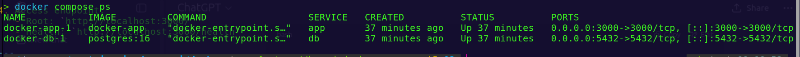
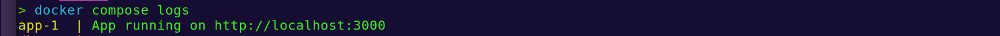
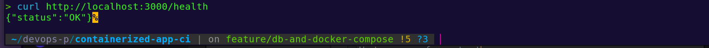
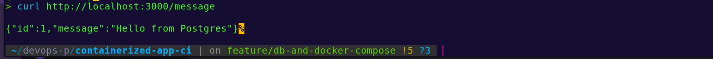

[](https://github.com/yankhoembekezani/containerized-app-ci/blob/main/LICENSE)
[](https://github.com/yankhoembekezani/containerized-app-ci)

## Project Purpose
A minimal Node.js application showcasing the base setup for future containerization and CI/CD workflows.

## Stack / Tools
- Node.js
- Express
- PostgreSQL
- Docker & Docker Compose 
- GitHub Actions (planned)

---

## Features (Current)
- Minimal API returning JSON: "Hello World"
- Runs locally with `npm start`
- PostgreSQL integration with a `messages` table
- Multi-container setup using Docker Compose (app+database)
- Containerized app and database, running together
- Health check endpoint (`/health`)
- Database message endpoint (`/message`) retrieving stored messages

---

## Planned Features
- Automated tests
- CI/CD pipeline with GitHub Actions
- Live cloud deployment
- Logging & monitoring

---

## Setup Instructions (locally without Docker)
1. Clone the repository:
   ```bash
   git clone https://github.com/yankhoembekezani/containerized-app-ci
   cd containerized-app-ci
   ```
2. Install dependencies:
   ```bash
   cd app
   npm install
   ```
3. Run the app locally:	
   ```bash
   npm start
   ```
4. Access endpoint:
   - Root: `http://localhost:3000/`
   - Health: `http://localhost;3000/health`

---

## Run with Docker Compose
1. Build and start all services
```
   docker compose up -d --build
```
This will start
   - app: Node.js backend on port 3000
   - db: PostgreSQL database on port 5432
2. Verify running containers:
```
   docker compose ps
```
**Expected Output**  


---
 
## Verification

- **App logs**  
  

- **Health check endpoint**  
  

- **Database message endpoint**  
  

App available at:
http://localhost:3000/

---

## Roadmap
- Day 1: Basic Node.js app ✅

- Day 2: Dockerized Node.js app ✅

- Day 3: Integrate a database (PostgreSQL) and extend functionality ✅

- Day 4: Use Docker Compose for multi-container setup (app + database) ✅

- Day 5+: Testing, CI/CD pipelines, monitoring, and cloud deployment

---

## Folder Structure
- `app/` – main application code (Node.js + Express)
- `docker/` – Dockerfile and docker-compose.yml 
- `tests/` – test files
- `assets/` – project resources
- `README.md` – documentation
- `LICENSE` – license details
- `CHANGELOG.md` – project changes log

---

## License

This project is licensed under the MIT License.  
See the [LICENSE](LICENSE) file for full details
